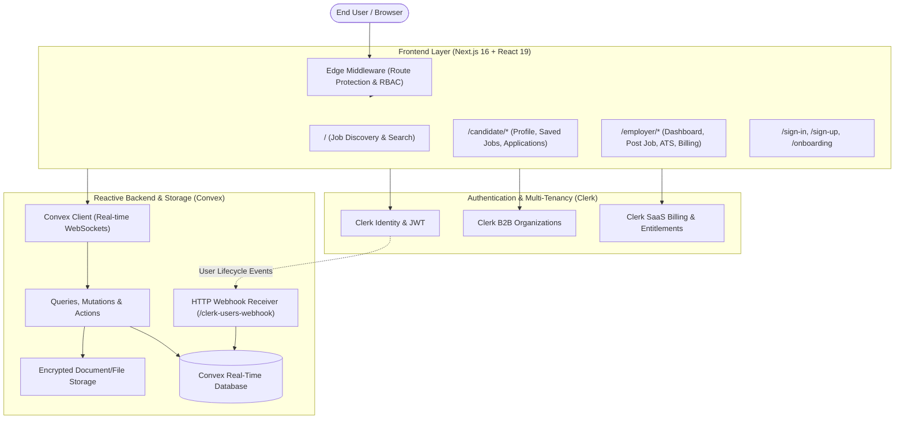

# Nexora — Enterprise Full-Stack Job Search & Hiring Platform
## Comprehensive Technical & Architecture Documentation

---

## 1. Executive Summary

**Nexora** is an enterprise-grade, modern recruitment and career ecosystem bridging top-tier talent with ambitious companies. Built with **Next.js 16**, **React 19**, **Convex Database & Real-Time Cloud**, and **Clerk Authentication & B2B Organizations**, Nexora delivers a frictionless experience for both job seekers (B2C) and hiring teams (B2B).

### Key Highlights
- **Sub-50ms Reactive UI**: Powered by Convex WebSocket subscriptions and optimistic UI updates for bookmarking, application submissions, and candidate tracking.
- **Enterprise Multi-Tenancy**: Clerk B2B Organizations allow hiring teams to switch workspaces, manage member seats, and publish vacancies under unified employer branding.
- **Quota-Gated SaaS Monetization**: Integrated Clerk Billing featuring tiered subscriptions (*Free*, *Starter*, *Pro*) controlling active job listing capacities.
- **Applicant Tracking System (ATS)**: Real-time Kanban-style candidate pipelines with stage progression (*Submitted*, *Under Review*, *Interviewing*, *Hired*, *Rejected*, *Withdrawn*).
- **Comprehensive Candidate Profiles**: Rich resumes, education, work history, verified skills, and shareable public profile URLs (`/candidate/[id]`).

---

## 2. System Architecture



---

## 3. Technology Stack Breakdown

| Layer | Technology | Version | Purpose & Rationale |
| :--- | :--- | :--- | :--- |
| **Framework** | Next.js (App Router, Turbopack) | `16.2.10` | High-performance server/client hybrid rendering, dynamic route optimization, and metadata SEO. |
| **Frontend UI Library** | React | `19.2.5` | Utilizes latest React features (`use(params)`, `useSyncExternalStore`, dynamic actions). |
| **Backend & Database** | Convex Cloud | `1.36.1` | Reactive ACID database, native real-time subscriptions, automatic schema generation, and binary file storage. |
| **Authentication & RBAC** | Clerk | `6.39.6` | Session management, OAuth logins (Google, GitHub, email OTP), B2B multi-tenant organizations, and billing. |
| **Styling & Design System** | Tailwind CSS 4 + Radix UI | `4.2.2` | Ultra-fast tokenized CSS engine, dark/light theme switching, accessible popovers, dialogs, and selects. |
| **Form Management** | React Hook Form + Zod 4 | `7.83.0` / `4.4.3` | Client preflight validation, zero unnecessary backend calls, and strict input schema verification. |
| **Icons & Notifications** | Lucide React + Sonner | `1.28.0` / `2.0.7` | Cohesive modern iconography and interactive, accessible toast notifications. |
| **Webhook Security** | Svix | `1.99.1` | Cryptographic signature validation for inbound Clerk user creation, update, and deletion events. |

---

## 4. Complete Database Schema (`convex/schema.ts`)

Convex utilizes a strongly-typed TypeScript document schema with compound indexes and full-text search indexes.

### 4.1. `users` Table
Stores synchronized Clerk user records and role classification.
- **Fields**:
  - `clerkUserId`: `string` (Unique Clerk User ID)
  - `clerkId`: `string` (Legacy compatibility fallback)
  - `firstName`, `lastName`, `name`: `string`
  - `email`: `string`
  - `imageUrl`: `string`
  - `role`: `"candidate" | "employer"`
- **Indexes**:
  - `by_clerkUserId` on `["clerkUserId"]`
  - `by_clerkId` on `["clerkId"]`

### 4.2. `jobs` Table
Stores published and draft career vacancies.
- **Fields**:
  - `title`: `string`
  - `companyName`: `string`
  - `companyLogo`: optional `string`
  - `location`: `string` (e.g. `"San Francisco, CA"`, `"Remote"`)
  - `employmentType`: `"full-time" | "part-time" | "contract" | "internship"`
  - `workMode`: `"remote" | "hybrid" | "onsite"`
  - `experienceLevel`: `"entry" | "junior" | "mid" | "senior" | "lead"`
  - `category`: `"Engineering" | "Design" | "Marketing" | "Sales" | "Product" | "Finance" | "Other"`
  - `salaryMin`, `salaryMax`: optional `number`
  - `salaryCurrency`: optional `string` (Defaults to `"USD"`)
  - `description`: `string`
  - `requirements`: optional `array<string>`
  - `status`: `"active" | "draft" | "closed"`
  - `authorUserId`: `string` (Clerk User ID of the creator)
  - `orgId`: `string` (Clerk Organization ID owning the listing)
  - `isFeatured`: optional `boolean`
- **Indexes & Search**:
  - `by_orgId` on `["orgId"]`
  - `by_orgId_and_status` on `["orgId", "status"]` (Compound index for dashboard queries)
  - `by_status` on `["status"]`
  - `by_category`, `by_employmentType`, `by_workMode`, `by_experienceLevel`
  - `search_title`: Full-text search on `title` with facet filtering
  - `search_company`: Full-text search on `companyName` with facet filtering

### 4.3. `applications` Table
Tracks job seeker applications submitted to open listings.
- **Fields**:
  - `jobId`: `Id<"jobs">`
  - `applicantUserId`: optional `string` (Clerk User ID)
  - `applicantName`: `string`
  - `applicantEmail`: `string`
  - `resumeStorageId`: optional `Id<"_storage">` (Convex file ID)
  - `resumeFileName`: optional `string`
  - `resumeUrl`: optional `string`
  - `coverLetter`: optional `string` (Note to hiring team)
  - `status`: `"submitted" | "under_review" | "interviewing" | "rejected" | "hired" | "withdrawn"`
  - `appliedAt`: `number` (Timestamp)
- **Indexes**:
  - `by_jobId` on `["jobId"]`
  - `by_jobId_and_status` on `["jobId", "status"]`
  - `by_applicantUserId` on `["applicantUserId"]`

### 4.4. `savedJobs` Table
Stores candidate bookmarks for quick tracking and application.
- **Fields**:
  - `userId`: `string` (Clerk User ID)
  - `jobId`: `Id<"jobs">`
  - `savedAt`: `number` (Timestamp)
- **Indexes**:
  - `by_userId` on `["userId"]`
  - `by_user_and_job` on `["userId", "jobId"]`

### 4.5. `candidateProfiles` Table
Rich curriculum vitae and professional biographical information.
- **Fields**:
  - `userId`: `Id<"users">`
  - `headline`: `string` (e.g. `"Senior Full-Stack Engineer"`)
  - `bio`: `string`
  - `location`: `string`
  - `skills`: `array<string>`
  - `experience`: `array<{ company, position, startDate, endDate, current, description }>`
  - `education`: `array<{ institution, degree, field, startDate, endDate }>`
  - `linkedinUrl`: `string`
  - `portfolioUrl`: `string`
- **Indexes**:
  - `by_userId` on `["userId"]`

### 4.6. `resumes` Table
Encrypted PDF/DOCX file attachments uploaded directly to Convex storage.
- **Fields**:
  - `userId`: `Id<"users">`
  - `storageId`: `Id<"_storage">`
  - `fileName`: `string`
  - `fileSize`: `number`
  - `mimeType`: `string`
  - `isDefault`: `boolean`
  - `createdAt`, `updatedAt`: `number`
- **Indexes**:
  - `by_userId` on `["userId"]`

### 4.7. `notifications` Table
Real-time candidate notifications for application milestone changes.
- **Fields**:
  - `userId`: `string` (Clerk User ID recipient)
  - `title`: `string`
  - `message`: `string`
  - `type`: `"application_received" | "status_change" | "system"`
  - `link`: optional `string`
  - `isRead`: `boolean`
  - `createdAt`: `number`
- **Indexes**:
  - `by_userId` on `["userId"]`
  - `by_userId_and_isRead` on `["userId", "isRead"]`

---

## 5. Application Feature Modules

### 5.1. Candidate Experience (B2C)
1. **Interactive Job Discovery (`/`)**:
   - Real-time debounced keyword search against job titles and company names.
   - Multi-facet filtering by category (Engineering, Design, Marketing, etc.), work mode (Remote, Hybrid, Onsite), employment type (Full-time, Contract, Internship), and experience level.
   - Quick Job Details modal with full specification, salary range, and company metadata.
2. **Instant Job Application**:
   - One-click application using default saved resume or drag-and-drop file upload.
   - Client-side validation ensuring required "Note to Hiring Team" is populated before dispatch.
   - Duplicate prevention: Candidates cannot apply twice to the same posting.
3. **Application Tracking Portal (`/candidate/applications`)**:
   - Real-time tracking of all submitted applications with color-coded status badges.
   - Detail view displaying submitted note, linked resume download, and submission timestamp.
   - Ability to self-withdraw an active application.
4. **Saved Jobs (`/candidate/saved-jobs`)**:
   - Bookmark jobs directly from the search feed with instantaneous Optimistic UI feedback.
   - Dedicated dashboard to review saved opportunities and apply directly.
5. **Profile & Resume Center (`/candidate/profile`)**:
   - Comprehensive resume builder: add work experience items, education degrees, verified skill chips, and social links.
   - Direct PDF resume uploader storing documents securely in Convex Cloud storage.
6. **Public Candidate Portfolio (`/candidate/[id]`)**:
   - Server-rendered public profile link designed for recruiters.
   - One-click clipboard share action and verified candidate badge.

---

### 5.2. Employer Experience (B2B)
1. **B2B Organization Workspaces**:
   - Powered by Clerk B2B Organizations. Teams can invite colleagues, assign administrator/member roles, and share job postings.
   - Integrated Clerk `<CreateOrganization />` and `<OrganizationSwitcher />`.
2. **Employer Analytics & Job Management (`/employer/dashboard`)**:
   - Real-time metrics: Total Jobs, Active Vacancies, Total Applications, and Hired Candidates.
   - Management table with inline status toggles (`Active`, `Closed`), edit job modal, and permanent delete.
   - Quota usage progress bar displaying remaining vacancy slots for the organization's plan.
3. **Smart Job Publishing (`/employer/post-job`)**:
   - Quota-gated form preventing postings when plan limits are reached.
   - Fields: Title, Company Name, Category, Work Mode, Employment Type, Experience Level, Salary Range, and Full Description.
4. **Applicant Tracking System (`/employer/applications`)**:
   - Pipeline filtering by specific job opening or candidate name.
   - Stage progression dropdown: Advance candidates through *Under Review*, *Interviewing*, *Hired*, or *Rejected*.
   - Direct resume viewer and quick candidate public profile inspection.
5. **Subscription & Billing Center (`/employer/billing`)**:
   - Clerk Billing embedded `<PricingTable />` with seamless in-app checkout drawer.
   - Live plan tier display (*Free*, *Starter*, *Pro*) with feature comparison matrix and FAQ.

---

## 6. Security, Authentication & Performance

### 6.1. Edge Middleware (`middleware.ts`)
- Configured with Clerk's `clerkMiddleware` to protect private routes at the edge:
  - `/employer(.*)`
  - `/onboarding(.*)`
  - `/candidate/profile(.*)`
  - `/candidate/applications(.*)`
  - `/candidate/saved-jobs(.*)`
- Unauthenticated users attempting to access protected pages are seamlessly redirected to Clerk sign-in with a preserved return URL.
- Public routes (`/` and `/candidate/[id]`) remain accessible to search engine crawlers and unauthenticated visitors.

### 6.2. Backend Zero-Trust Enforcement
- Every mutation in `convex/jobs.ts` and `convex/applications.ts` validates `ctx.auth.getUserIdentity()`.
- Job edits and deletions enforce `job.authorUserId === identity.subject` to prevent IDOR (Insecure Direct Object Reference).
- Migration scripts and user sync operations are declared as `internalMutation` ensuring they cannot be triggered over the public WebSocket API.

### 6.3. Webhook Cryptographic Verification (`convex/http.ts`)
- Inbound user lifecycle events from Clerk are verified using **Svix** headers (`svix-id`, `svix-timestamp`, `svix-signature`) and the secret `CLERK_WEBHOOK_SECRET`.

### 6.4. HTTP Security Headers (`next.config.ts`)
- Enforces strict browser security:
  - `X-Content-Type-Options: nosniff`
  - `X-Frame-Options: SAMEORIGIN`
  - `Referrer-Policy: strict-origin-when-cross-origin`
  - `Permissions-Policy: camera=(), microphone=(), geolocation=()`

---

## 7. Directory Structure

```
jobly-job/
├── app/                              # Next.js App Router Pages
│   ├── candidate/
│   │   ├── [id]/page.tsx             # Public candidate profile
│   │   ├── applications/page.tsx     # Candidate applied jobs tracking
│   │   ├── profile/page.tsx          # Resume & profile builder
│   │   └── saved-jobs/page.tsx       # Saved jobs dashboard
│   ├── employer/
│   │   ├── applications/page.tsx     # ATS candidate review pipeline
│   │   ├── billing/page.tsx          # SaaS subscription & pricing
│   │   ├── dashboard/page.tsx        # Employer job management hub
│   │   ├── post-job/page.tsx         # Create job listing form
│   │   ├── saved-jobs/page.tsx       # Employer saved listings
│   │   └── layout.tsx                # Employer auth & organization gate
│   ├── onboarding/page.tsx           # Role selector (Candidate vs Employer)
│   ├── sign-in/                      # Clerk embedded sign-in
│   ├── sign-up/                      # Clerk embedded sign-up
│   ├── error.tsx                     # Route-level error boundary
│   ├── global-error.tsx              # Root HTML crash recovery boundary
│   ├── not-found.tsx                 # 404 custom experience
│   ├── layout.tsx                    # Root layout, fonts, theme provider
│   └── page.tsx                      # Main landing & job discovery feed
├── components/                       # Shared React Components
│   ├── ui/                           # Radix/Tailwind design tokens
│   ├── ConvexClientProvider.tsx      # Convex React client wrapper
│   ├── DynamicClerkProvider.tsx      # Theme-synchronized Clerk wrapper
│   ├── EmployerHeader.tsx            # Navigation bar for employers
│   ├── MainHeader.tsx                # Main navigation bar with role switcher
│   ├── NotificationBell.tsx          # Real-time bell dropdown
│   ├── PricingSection.tsx            # Clerk billing pricing tables
│   ├── ResumeManager.tsx             # PDF resume upload and preview
│   └── ThemeToggle.tsx               # Dark / light theme switch
├── convex/                           # Backend Cloud Functions
│   ├── _generated/                   # Auto-generated type bindings
│   ├── applications.ts               # Application CRUD & status mutations
│   ├── candidateProfiles.ts          # Candidate profile queries & saves
│   ├── http.ts                       # Svix Clerk webhook endpoint
│   ├── jobs.ts                       # Job publishing, search & filtering
│   ├── notifications.ts              # Real-time user alert dispatch
│   ├── resumes.ts                    # File storage generation & links
│   ├── savedJobs.ts                  # Bookmark toggling & queries
│   ├── schema.ts                     # Convex TypeScript database schema
│   └── users.ts                      # User records & role synchronization
├── lib/
│   ├── orgHelpers.ts                 # Plan tier quotas & helper logic
│   ├── schemas.ts                    # Zod form validation definitions
│   └── utils.ts                      # CSS class concatenation (cn)
├── public/                           # Static brand assets & logos
├── middleware.ts                     # Clerk route protection at edge
├── next.config.ts                    # Image domains & security headers
├── package.json                      # Project dependencies & scripts
└── .env.example                      # Production environment template
```
